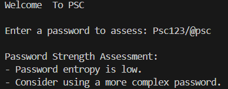
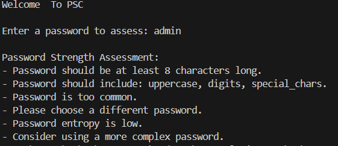
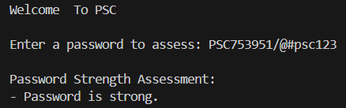

# PSC - Password Strength Checker

**Name:** OM HASE  
**Company:** CODTECH IT SOLUTIONS  
**ID:** CT8CSEH1649  
**Domain:** CYBER SECURITY & ETHICAL HACKING  
**Duration:** July To September 2024  
**Mentor:** NEELA SANTHOSH KUMAR

## **Overview Of Project**

PSC (Password Strength Checker) is a Python-based tool designed to assess the strength of passwords. It evaluates password length, complexity, uniqueness, and entropy to determine how secure a password is. The tool provides feedback on improving weak passwords to enhance security.

## **Features**

- **Length Check:** Ensures the password meets the minimum length requirement.
- **Complexity Check:** Verifies the inclusion of lowercase letters, uppercase letters, digits, and special characters.
- **Uniqueness Check:** Detects if the password is a common or easily guessable password.
- **Entropy Calculation:** Measures the password's entropy to gauge its randomness and unpredictability.
- **Feedback:** Provides detailed suggestions to help users create stronger passwords.

## **Output Images**
- **Output 1**
  
  

- **Output 2**

  

- **Output 3**

  

## **Installation**

**Clone the repository:**

   ```bash
   git clone https://github.com/OM-HASE/CODTECH-TASK-2.git
   ```

## **Usage**

1. Run the script using Python 3:
   ```bash
   pyhton Task-2-PASSWORD-STRENGTH-CHECKER-PSC.py
   ```
2. Enter a password when prompted, and receive feedback on its strength.

## **Code Overview**

Core Functions
- **calculate_entropy(password):** Calculates the entropy of a given password to measure its randomness.
- **check_length(password):** Checks if the password meets the minimum length requirement.
- **check_complexity(password):** Validates the complexity of the password by ensuring it contains lowercase, uppercase, digits, and special characters.
- **check_uniqueness(password):** Checks if the password is commonly used and easily guessable.
- **assess_password_strength(password):** Combines all checks and provides feedback on the password's strength.

## **Main Function**
- **main():** The main function that runs the Password Strength Checker (PSC) and provides an interactive prompt for users to input their passwords.

## **Contributing**
Contributions are welcome! Feel free to open issues, submit pull requests, or suggest improvements.

## **Contact Information**
For any questions or issues, please contact OM HASE at omhase9955@gmail.com .
